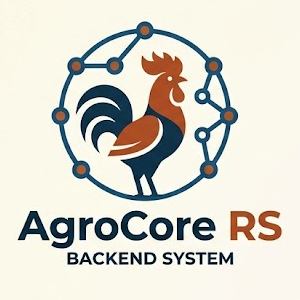

#  AgroCore RS

[](https://www.rust-lang.org/)
[](LICENSE)

**AgroCore RS** is a high-performance, modular management system designed specifically for the modern agricultural industry. Built with the power and safety of **Rust**, it offers a robust platform for managing every aspect of your farming operations—from vineyards and olive groves to complex logistics and EU compliance.

## 🚀 Key Features

- **🌾 Comprehensive Farm Management:** Manage sites, parcels, and diverse crop types (Vineyards, Olives, etc.) with ease.
- **📋 Task & Order Tracking:** Streamline operations with a powerful task management system and real-time order tracking.
- **📊 Advanced Analytics:** Integrated **Grafana** dashboards for real-time monitoring of system metrics and farm data.
- **☁️ Weather & Climate Integration:** Stay ahead of the weather with built-in climate data processing and phenology records.
- **🛡️ EU Compliance & PAC Aid:** Built-in modules for audit logging, checklists, and managing PAC aid applications.
- **👥 Workforce Management:** Handle worker contracts, roles, and task assignments efficiently.
- **💰 Financial Tracking:** Monitor cost centers, financial records, and participation in eco-schemes.
- **🛠️ Modern Admin UI:** A sleek, reactive web interface built with **Leptos** and **Tailwind CSS**.

## 🛠 Tech Stack

- **Backend:** [Rust](https://www.rust-lang.org/) (2024 edition) with [Actix-web](https://actix.rs/)
- **Frontend:** [Leptos](https://leptos.dev/) (WASM) & [Tailwind CSS](https://tailwindcss.com/)
- **Database:** [MongoDB](https://www.mongodb.com/) for flexible data storage
- **Messaging:** [NATS](https://nats.io/) for high-performance service communication
- **Infrastructure:** [Docker](https://www.docker.com/), [Prometheus](https://prometheus.io/), [Loki](https://grafana.com/oss/loki/), and [Grafana](https://grafana.com/)

## 🏗 Project Structure

The project is organized as a clean Cargo workspace:

- `crates/api`: The web API layer (Actix-web, OpenAPI/Swagger).
- `crates/admin-ui`: The modern WASM-based dashboard (Leptos).
- `crates/domain`: Core business logic and entities.
- `crates/infrastructure`: Data persistence and external integrations.
- `crates/messaging`: NATS-based event system.
- `crates/shared`: Common utilities and types.

## 🐳 Quick Start with Docker

The easiest way to get AgroCore RS up and running is using Docker Compose. This starts the API, the Admin UI, and all required infrastructure (MongoDB, NATS, Grafana, etc.).

### Build Optimization (Recommended)
To significantly speed up the build process, we use a custom base image that contains all necessary build tools. 

1. **Build the base image:**
   ```bash
   docker build -t agrocore-build-base -f Dockerfile.base-build .
   ```

2. **Launch everything:**
   ```bash
   docker-compose up -d --build
   ```

3. **Access the services:**
   - **Admin UI:** [http://localhost:<PORT>/admin](http://localhost:<PORT>/admin) (Find `<PORT>` with `docker compose ps`)
   - **API Swagger Docs:** [http://localhost:<PORT>/swagger-ui/](http://localhost:<PORT>/swagger-ui/)
   - **Grafana Dashboards:** [http://localhost:3001](http://localhost:3001) (Default login: `admin` / `admin`)

## 🔧 Manual Development Setup

### Requirements
- [Rust](https://www.rust-lang.org/tools/install) (the latest stable)
- [Trunk](https://trunkrs.dev/) (for UI development)
- [MongoDB](https://www.mongodb.com/) running locally

### Environment Variables
| Variable        | Description               | Default                     |
|-----------------|---------------------------|-----------------------------|
| `DATABASE_URL`  | MongoDB connection string | `mongodb://localhost:27017` |
| `DATABASE_NAME` | MongoDB database name     | `agrocore`                  |
| `LISTEN_ADDR`   | API server listen address | `0.0.0.0:3000`              |
| `NATS_URL`      | NATS server URL           | `nats://localhost:4222`     |

### Running the Project
```bash
# Run the API
cargo run -p agrocore-api

# Run the Admin UI (Development Mode)
cd crates/admin-ui
trunk serve
```

## 📜 License

This project is licensed under the [GNU GPL v3.0 or later](LICENSE).

---
*Empowering agriculture through technology.*
