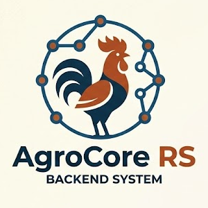

#  AgroCore RS

[](https://www.rust-lang.org/)
[](LICENSE)
[](https://github.com/peopleandpixel/agrocore-rs/actions/workflows/ci-cd.yml)
[](CHANGELOG.md)

AgroCore RS is a farm operations platform built from scratch in this repository. The code, structure, naming, and product decisions were created here independently, while the implementation benefits from practical experience gained in earlier professional work.

The goal is simple: give the office a single system that stays usable under real farm conditions. AgroCore brings together field management, tasks, weather, livestock, finance, compliance, equipment, and administration in one workflow instead of scattering daily work across isolated tools.
It is designed to run locally by default, but the services can also be distributed if you want that setup. Data can stay fully on-premise or be placed on remote services where that makes operational sense. Cloud is an option, not a requirement.

## Why AgroCore?

AgroCore is designed for teams that need to record, check, and later evaluate operational data without fighting the software.

- One place for office-side farm administration
- Fast capture of fields, jobs, livestock, resources, and compliance data
- Setup-driven workflows so a clean system starts clean
- Internationalized UI for multilingual teams
- Practical admin screens instead of a marketing shell
- Local development flow that avoids unnecessary container rebuilds

## What Makes It Useful

- Field and site management with a focus on real operational data
- Task and order handling for office and planning workflows
- Weather and phenology views, including fallback weather lookup when no station exists
- Livestock records and treatments
- Finance, cost centers, PAC-related workflows, and reporting
- Compliance and certification tracking
- Equipment and resource management
- A reactive Admin UI for day-to-day office work

## Technology

- Rust 2024
- Actix Web for the API
- Leptos for the Admin UI
- PostgreSQL / PostGIS for persistence
- NATS for messaging
- Docker for local infrastructure

## Repository Layout

- `crates/api`: HTTP API and request handlers
- `crates/admin-ui`: Web UI
- `crates/domain`: Business logic and entities
- `crates/infrastructure`: Persistence and integrations
- `crates/messaging`: Event and messaging support
- `crates/reporting-service`: Excel/GeoJSON/PAC-SIP export worker
- `crates/weather-service`: Weather data ingestion worker

## Local Development

The repository includes a host-based development flow so the services can run without rebuilding containers on every change.

```bash
./scripts/dev.sh
```

That script starts the local infrastructure, runs the API, and serves the Admin UI.

### Direct Startup

```bash
cargo run -p agrocore-api
```

```bash
cd crates/admin-ui
trunk serve
```

## Docker Compose (Production-Ready)

Docker Compose is available for a fully containerized run, suitable for production deployment.

```bash
docker compose up -d
```

Services:
- **postgres**: PostgreSQL 16 + PostGIS with auto-migrations (15 migration files)
- **nats**: NATS 2.10 with JetStream
- **api**: Actix Web API on port 8080
- **reporting-service**: Export worker (Excel, GeoJSON, PAC-SIP)
- **weather-service**: Weather data ingestion worker
- **admin-ui**: Leptos Admin UI on port 3000

All services include health checks and proper dependency ordering.

## Testing

Tests are organized in separate directories under `crates/api/tests/`:

```bash
cargo test --workspace
```

| Handler | Tests |
|---------|-------|
| auth | Login validation, password rules |
| sites | DTO serialization, validation |
| orders | Create/Update DTO tests |
| users | User DTO tests |
| tasks | Task DTO tests |
| weather | Station/Data DTO tests |
| finance | PAC/CostCenter tests |
| livestock | Animal/Treatment tests |
| reporting | Pagination tests |

**Rate Limiting:** 120 requests/minute per IP via `actix-governor`.

## Security

- JWT tokens expire after **30 minutes**
- Password hashing via **argon2**
- Rate limiting via Governor (120 req/min)
- Security headers: X-Frame-Options, CSP, HSTS

Run security audit:
```bash
cargo audit
```

## License

This project is licensed under the GNU GPL v3.0 or later.
